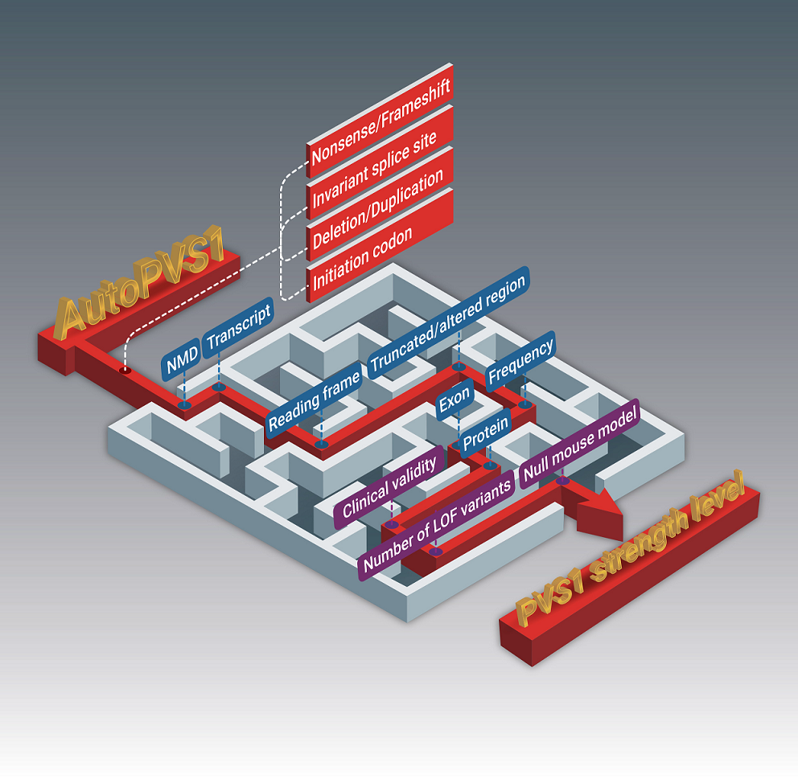
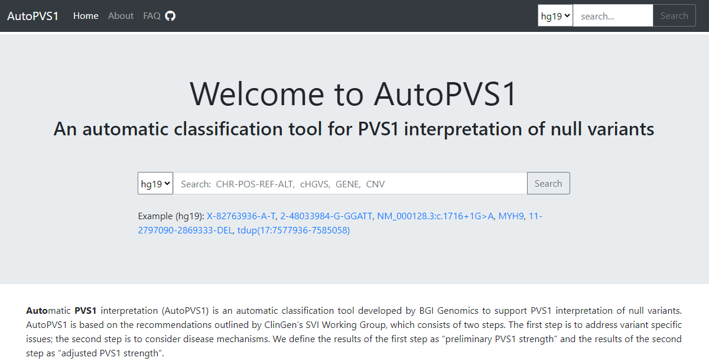

# AutoPVS1
An automatic classification tool for PVS1 interpretation of null variants.


A web version for AutoPVS1 is also provided: http://autopvs1.genetics.bgi.com


:art: **AutoPVS1** is now compatible with **hg19/GRCh37** and **hg38/GRCh38**.

## PREREQUISITE
### 1. Variant Effect Predictor (VEP)
**AutoPVS1** use [VEP](https://asia.ensembl.org/info/docs/tools/vep/index.html) to determine the effect of 
variants (SNVs, insertions, deletions, CNVs) on genes, transcripts, and protein sequence.
To get HGVS name for the variant, indexed_vep_cache (homo_sapiens_refseq 104_GRCh37 and 104_GRCh38) and fasta files are required.

#### VEP Installation

```bash
git clone https://github.com/Ensembl/ensembl-vep.git
cd ensembl-vep
git pull
git checkout release/104
perl INSTALL.pl
```

#### VEP cache and faste files
VEP cache and faste files can be automatically downloaded and configured using [INSTALL.pl](https://www.ensembl.org/info/docs/tools/vep/script/vep_download.html#installer). You can also download and set up them manually:

```bash
r=104
FTP='ftp://ftp.ensembl.org/pub/'

# indexed vep cache
cd $HOME/.vep
wget $FTP/release-${r}/variation/indexed_vep_cache/homo_sapiens_refseq_vep_${r}_GRCh38.tar.gz
wget $FTP/release-${r}/variation/indexed_vep_cache/homo_sapiens_refseq_vep_${r}_GRCh37.tar.gz
tar xzf homo_sapiens_vep_${r}_GRCh37.tar.gz
tar xzf homo_sapiens_vep_${r}_GRCh38.tar.gz

# fasta
cd $HOME/.vep/homo_sapiens_refseq/${r}_GRCh37/
wget $FTP/grch37/current/fasta/homo_sapiens/dna/Homo_sapiens.GRCh37.dna.primary_assembly.fa.gz
tar xzf Homo_sapiens.GRCh37.dna.primary_assembly.fa.gz

cd $HOME/.vep/homo_sapiens_refseq/${r}_GRCh38/
wget $FTP/current_fasta/homo_sapiens/dna/Homo_sapiens.GRCh38.dna.primary_assembly.fa.gz
tar xzf Homo_sapiens.GRCh38.dna.primary_assembly.fa.gz
```

### 2. autopvs1

```bash
git clone -b dev https://github.com/pzweuj/autopvs1.git
cd autopvs1
python3 setup install --user
```

### 3. Configuration

`autopvs1-dev/autopvs1/config.ini`

```ini
[DEFAULT]
vep_cache = $HOME/.vep
pvs1levels = data/PVS1.level
gene_alias = data/hgnc.symbol.previous.tsv
gene_trans = data/clinvar_trans_stats.tsv

[HG19]
genome = data/hg19.fa
transcript = data/ncbiRefSeq_hg19.gpe
domain = data/functional_domains_hg19.bed
hotspot = data/mutational_hotspots_hg19.bed
curated_region = data/expert_curated_domains_hg19.bed
exon_lof_popmax = data/exon_lof_popmax_hg19.bed
pathogenic_site = data/clinvar_pathogenic_GRCh37.vcf

[HG38]
genome = data/hg38.fa
transcript = data/ncbiRefSeq_hg38.gpe
domain = data/functional_domains_hg38.bed
hotspot = data/mutational_hotspots_hg38.bed
curated_region = data/expert_curated_domains_hg38.bed
exon_lof_popmax = data/exon_lof_popmax_hg38.bed
pathogenic_site = data/clinvar_pathogenic_GRCh38.vcf
```

You can specify the vep cache directory to use, default is `$HOME/.vep/`

**hg19.fa** is downloaded from UCSC [hg19.fa.gz](https://hgdownload.soe.ucsc.edu/goldenPath/hg19/bigZips/) and indexed with `samtools faidx`

**hg38.fa** is downloaded from NCBI [GRCh38_no_alt_analysis_set.fna.gz](http://ftp.ncbi.nlm.nih.gov/genomes/all/GCA/000/001/405/GCA_000001405.15_GRCh38/seqs_for_alignment_pipelines.ucsc_ids/) and indexed with `samtools faidx`

**Note:** the chromesome name in fasta files should have `chr` prefix

## USAGE

```python
from autopvs1 import AutoPVS1
demo = AutoPVS1('13-113803407-G-A', 'hg19')
demo2 = AutoPVS1('13-113149093-G-A', 'hg38')

if demo.islof:
    print(demo.hgvs_c, demo.hgvs_p, demo.consequence, demo.pvs1.criterion, 
          demo.pvs1.strength_raw, demo.pvs1.strength)

# GRCh37 and GRCh38 is also supported
demo = AutoPVS1('13-113803407-G-A', 'GRCh37')
demo2 = AutoPVS1('13-113149093-G-A', 'GRCh38')

# VEP Merged Cache supported
demo = AutoPVS1('13-113803407-G-A', 'GRCh37', vep_mode='merged')
```

## FAQ
Please see https://autopvs1.genetics.bgi.com/faq/

## TERM OF USE
Users may freely use the AutoPVS1 for non-commercial purposes as long as they properly cite it. 

This resource is intended for research purposes only. For clinical or medical use, please consult professionals.

:memo:**citation:** *Jiale Xiang, Jiguang Peng, Samantha Baxter, Zhiyu Peng. (2020). [AutoPVS1: An automatic classification tool for PVS1 interpretation of null variants](https://onlinelibrary.wiley.com/doi/epdf/10.1002/humu.24051). Hum Mutat 41, 1488-1498.* ([Editor's choice](https://onlinelibrary.wiley.com/doi/toc/10.1002/%28ISSN%291098-1004.HUMU-Editors-Choice) and [cover article](https://onlinelibrary.wiley.com/doi/abs/10.1002/humu.24098))

